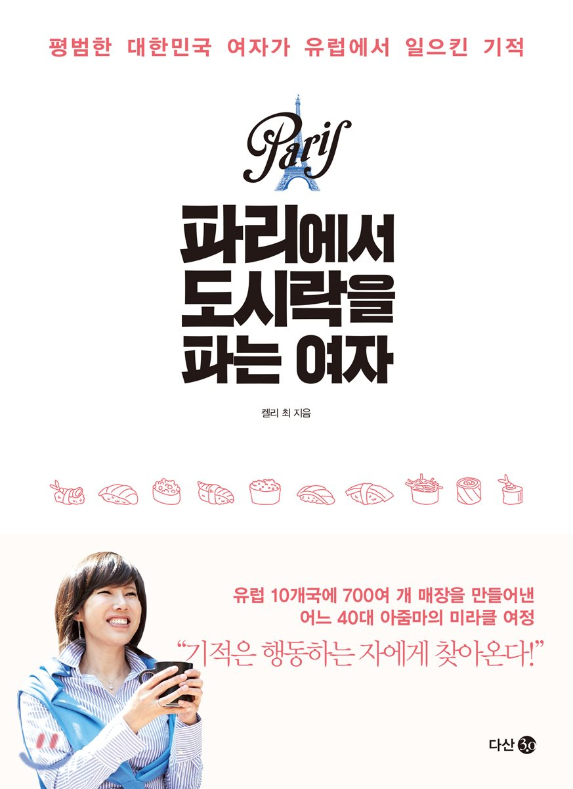

# 파리에서 도시락을 파는여자 독후감

나의 평점(10점 만점) : 8.4

이 책은 캘리 최라는 사람의 일대기를 써놓은 책이다. 그녀의 삶속에서 그녀의 철학을 엿볼수 있었으며, 사업을 얻으면서 깨달은 많은 팁들이 담겨 있다. 이 책을 처음 알게 된건 유튜브에 셀프메이드 영상을 보면서 였다. 그냥 내용만 쭉 보고 넘어갔었는데 내가 근무하는 도서관에 이 책을 반납한 사람이 있어서 우연찮게 보게 되었다. 책이 일대기라 비교적 읽기도 쉽게 되어있어 재밌게 읽었다.
## 열심히 한다고 그만큼 보상받는 것은 아니다.
## 무엇을 준비해야 하는가.
## 어떻게 해야 행복한 사업을 할 수 있을까?
## 항상 도전하고 변화하는자가 승리한다.
