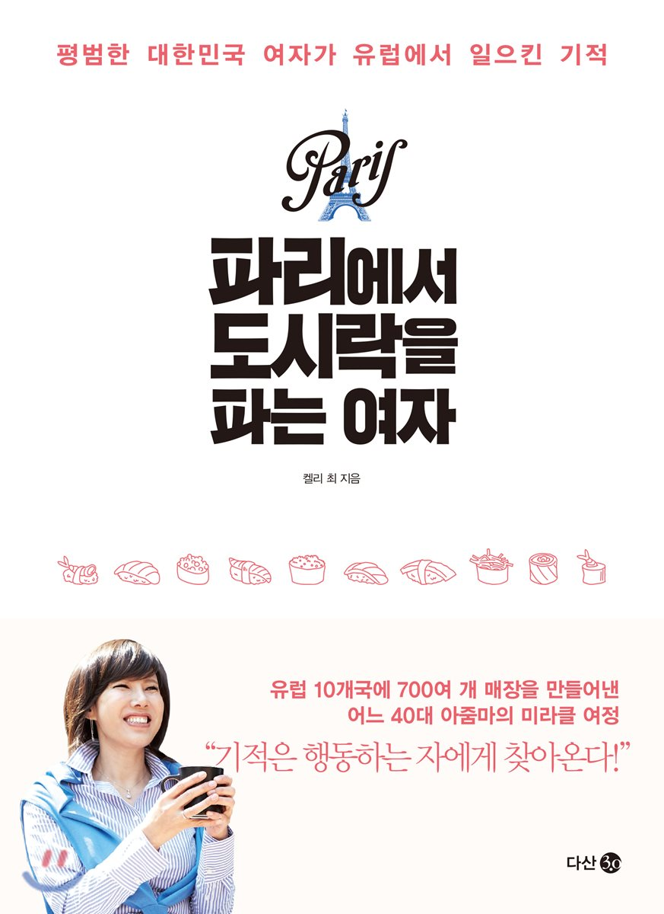
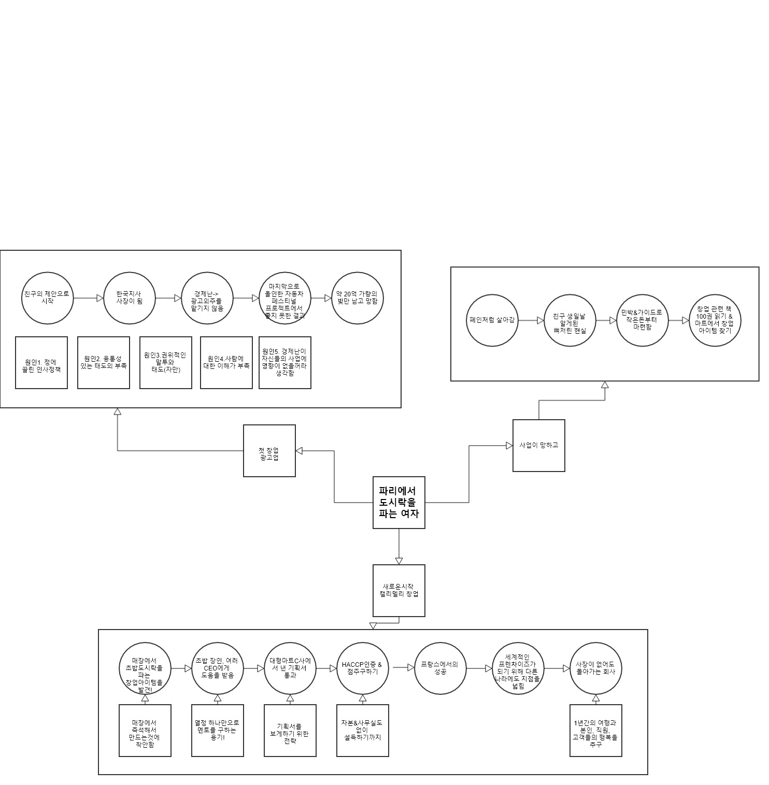

# 파리에서 도시락을 파는여자 독후감

나의 평점(10점 만점) : 8.4

 이 책은 캘리 최라는 사람의 일대기를 써놓은 책이다. 그녀의 삶속에서 그녀의 철학을 엿볼수 있었으며, 사업을 얻으면서 깨달은 많은 팁들이 담겨 있다. 이 책을 처음 알게 된건 유튜브에 셀프메이드 영상을 보면서 였다. 그냥 내용만 쭉 보고 넘어갔었는데 내가 근무하는 도서관에 이 책을 반납한 사람이 있어서 우연찮게 보게 되었다. 책이 일대기라 비교적 읽기도 쉽게 되어있어 재밌게 읽었다.

## 열심히 한다고 그만큼 보상받는 것은 아니다.
열심히 한만큼 보상을 받는 것은 이 사회에서 어떻게 보면 당연한 이치인것 같다. 하지만 현실에서는 그저 이상적인 말에 불과하다. 그녀는 어릴때부터 가난한 가정에 태어나서 고등학교때부터 학업을 스스로 해결하여 가족 지원 없이 해외 대학까지 나온다. 그런 그녀에게 돈에 대한 갈망은 매우 컸다. 그녀의 친구가 같이 알바겸 사업을 하자고 한것이 그녀가 처음으로 창업에 발을 들이게 되는 계기가 된다. 전공이 디자인 쪽임에도 광고업으로 들어오게 되서 처음엔 전전긍긍했지만, 꾸준히 회사는 성장해 나갔다. 그러나 경제위기가 오고, 광고를 외주 주는 회사가 줄어들자, 자연스럽게 경영난이 오게되고 마지막에 올인하여 기획한 코엑스에서의 자동차 전시회까지 기대한 성과를 못미치자, 20억 정도의 빚만이 그녀에게 남았다.

그녀의 이야기를 들어보면 그녀는 밤낮, 주말 가리지 않고 열심히 일을 했다. 그렇지만 대차게 망했다. 여기서 그저 노력하는것 뿐만 아니라 노력하는 방향의 중요성을 알 수 있으며, 망한것을 운과 남에게 치부하지 않고 한국지사의 사장이였던 자기 자신에게 있다는 피드백을 통해 다시 일어날때 큰 도움이 되는 교훈이 됬음을 알 수 있다.

## 무엇을 준비해야 하는가.
그녀는 사업이 망하고 근 2년간 폐인처럼 생활했다. 어느날 친구와의 파티에서 그녀는 주변인들이 실패한 켈리가 아닌 성공한 켈리를 친구로 삼고 싶어한다는 비참한 현실에 오열했으며, 사업 관련 공부를 다시 시작하여 도전하는 계기가 되었다. 먼저 사업관련 100권의 책을 읽었다고 하는데, 매우 대단한듯 하다. 나는 이제 첫번째 책 독후감 쓰는데도 힘들어 주글라 한다...ㅋㅋㅋ 어찌됬건 사업을 하기위한 기초 체력과 지식을 쌓는 기간이다. 우리는 나를 받아주는 직장이 없어서 창업을 하는게 아닌, 창업을 함으로써 도전이 우리의 가슴을 뛰게만들어 주기에 하는 것이기 때문이다.

그 후 그녀는 2년간 마트 직원보다 더 살았다고 한다. 이는 창업아이템을 찾는 과정이다. 그녀 나름대로 규칙을 세워서 선정을 한다. 나도 아이템들이 종종 떠오르지만 내 가슴을 뛰게 만드는 아이템을 아직 떠오르지 않아서 아쉽다. 그녀는 초밥도시락이라는 아이템이 떠올랐고, 즉석해서 매장안에서 판매하면 신선함, 신뢰성, 비용, 품질 등 면에서 유리할 것이라 판단하였다. 실제로 아이템을 찾기 위해 스타트업에서 많이들 하는 방법이라고 한다. 이전에 태용영상에서 봤던 토스 또한 직원들이 길거리를 돌아다니며 어떠한 앱이 필요할까 아이디어를 구상하는 미션을 가졌었는데, 거기서 나온 수십가지의 아이디어 중 하나가 토스였다고 한다.

빚만 가득했던 그녀, 돈이 없던 그녀는 그저 열정 하나 가지고 우리라면 포기하고 하지 않을 이미 성공했다고 알려진 사람들을 찾아 도움을 요청한다. 그것도 무일푼으로!! 저 유명한 사람이 나랑 대면을 해줄까? 라는 두려움 때문에 많은 사람들은 연락조차 하지 않는다. 그녀는 수단과 방법을 가리지 않고 최고의 스시 장인, 무일푼에서 성공한 김밥CEO, 맥도날드 CEO와의 멘토링을 받을 수 있었다. 이미 돈이 충분히 있는 그들에게는 과거 자신들이 불타올르게했던 열정이 그 값을 치르게 해줄수도 있다는 것을 말해준다. 도움을 청하지 않으면 도움을 받을 수 없다. 이것은 어린아이도 아는 애기다. 하지만 우리는 거절에 대한 두려움에 도움조차 바라지 않는다. 여기서부터 그녀와 나의 마인드 차이가 느껴졌다.

운이 좋게도 당시 프랑스 대형마트의 CEO가 그녀의 기획서를 보아서 실제로 매장을 낼 수 있게 되었다. 수 천, 수 만개의 기획서 중 짬나는 시간에 그녀의 기획서를 집어서 봤다니, 그야 말로 운이 좋다고 밖에 말할 수 없다. 하지만 그녀는 거기서 전략을 썼다. CEO의 나이와 성향을 분석해 기획서를 4장으로 대폭 줄였고 핵심인 내용을 넣었으며, 사업 아이템이 뺏기지 않도록 하였다. 당연히 이런 전략을 썼다 하더라도 운이 없으면 면담조차 하지 못했을 것이다. 하지만 이 사실만은 알아야 한다. 그녀가 해당 마트와 계약하지 못했다 하더라도, 계속해서 도전했을 것이며, 다른 연락 방법을 취하거나 하는 등 결국에는 계약이 성공될 때까지 도전할 것이라는 것이다. 실패는 성공을 위한 발판이다. 라는 말이 있다. 1번의 성공을 위해 99번의 실패가 필요할때, 실패를 발판으로 생각하느냐, 그저 결과에 좌절을 하느냐가 또 판가름을 나누는게 아닌가 싶다.

## 어떻게 해야 행복한 사업을 할 수 있을까?
사업이 어느 정도 안정되고 문제가 발생했다. 일을 하고 돈은 많이 벌지만, 정작 행복하지 않다는 것이다. 일과 일상의 균형, 삶의 질을 여기서 고민하게 되는데, 여기서 그녀가 가장 중요하게 생각했던건 가족 그 중에서도 자신의 아이였다. 그녀는 가족과 함께하는 시간을 매일 꼭 할당했으며, 자신의 행복뿐만 아닌 직원의 행복 또한 중요함을 알고 복지를 개선하게 된다. 어떻게 해야 돈도 벌고 만족스러운 삶을 살까? 개개인마다 다르겠지만 내 생각은 이러하다. 첫째, 회사에서 즐겁게 일을 할 수 있어야 한다. 그저 돈을 벌기 위해 언제 끝날지 시계만 바라보면서 일하는 것은 삶을 피폐해지게 한다. 둘째, 적절한 일감과 할당량을 다 채우면 그에 대한 보상인 조기 퇴근이다. 특히 한국에서 치부 되는 일감 몰아주기와 야근에 찌들어서 그런것일까? 나는 한명한테 정당한 일량이 들어와야되며, 할당량을 빠르게 다 채웠으면 그에 걸맞는 보상이 있어도 된다라고 생각한다. 셋째, 가족과 함께 할 수 있는 시간 및 지원이다. 요즘은 엄마 아빠가 애를 키우는게 아닌 타인이 거의 키우는게 정형화된것 같다. 가족과 함께 할 수 있는 시간은 많아질수록 삶의 질의 향상에 도움이 될거라 생각된다. 넷째, 직급에 상관없는 발언권 등 자유성이다. 내가 해외 문화중 너무 부러워하는것 중 하나이다. 한국은 너무 계급사회에 찌들어 있다. 효율(?)적이라고는 하지만 낮은 직급의 의견이 도태되고 무시되어선 안된다.

## 항상 도전하고 변화하는자가 승리한다.
이 세상에 100년기업은 보기가 참 힘들다. 부자도 3대를 못간다는 말도 있으니 말이다. 그 잘나가는 기업들도 어느순간 무너져있기 마련이다. 현재 기업의 트렌드는 변화이다. 이전에도 계속 변화해 왔지만, 최근 급변하는 트렌드와 개인성향이 강해짐에 따라 더욱 심해진것 같다. 아무리 잘나가는 게임&앱을 만들어도 업데이트가 지속적으로 되지 않으면 인기가 시들어진다. IT발달이 극을 다다르고 있는 지금이 바로 기회의 시기이다. 정직하고 좋은 아이템을 만들 수만 있다면 이제는 올바른 가치를 평가 받을 수 있게 되었다. 도전하고 실행하라. 기적은 행동하는 자에게만 찾아온다.

이외에도 사업을 하면서 배우고 느꼈던 많은 팁들이 책에 담겨져있다. 프랑스에서 시작된 창업이 전세계 프렌차이즈로 퍼져나가서 4명의 부하직원에게 기업을 맡기고 사장없이 돌아가는 회사를 만든 후, 1년간 요트여행을 하기까지의 그녀의 삶이 이 책에 녹아들어 있다. 지금도 계속해서 새로운 도전을 하고 있을 그녀의 열정에 박수를 보내며, 실패에서부터 딪고 일어난 창업의 과정을 보여주고, 창업가로서 꿈을 꾸는데 도움을 주는것에 감사를 표한다.