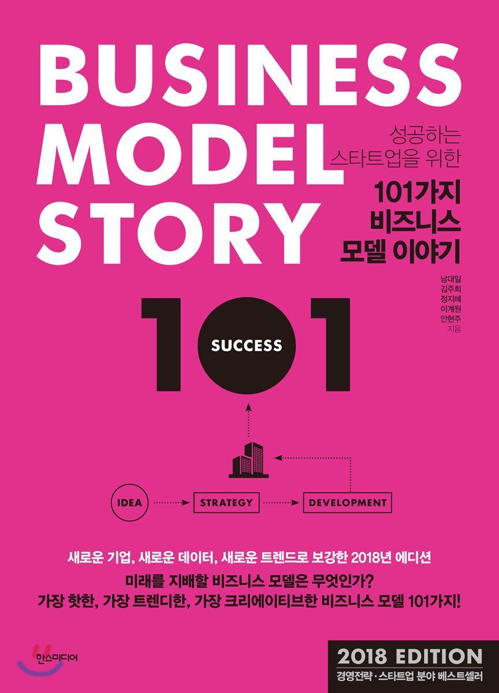
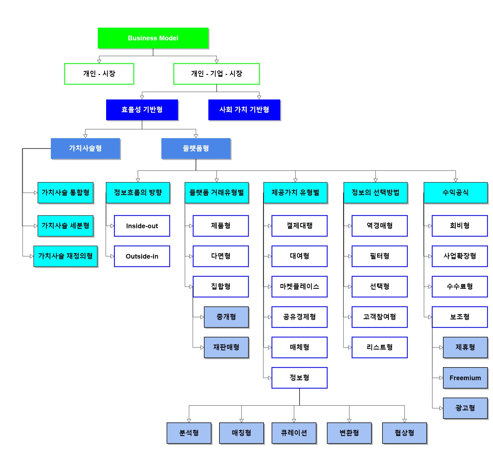

# 101가지 비즈니스 모델 이야기 독후감

나의 평점(10점 만점) : 7.2

101가지의 비즈니스 모델을 유형별로 나눠서 소개하는 책이다. 새로운 창업을 시도해보려 하는사람은 한번쯤 읽어보면 좋은 책인것 같다.

## 돈 버는 방법 참 많다..
이 책을 보면서 느낀게 이게 돈이 돼? 라는 사업도 꽤 있었다는 것이다. 내가 관심이 없는 분야였다면 더더욱 그랬던것 같다. 내가 관심을 갖고 봤던것은 누구에게 금액을 요구하는 것이다. 크게 이용자, 구매자, 회사로 나누어 보겠다. 이용자 같은 경우에는 회비(구독료) 또는 이용비용의 수수료를 금액으로 요구 할 수 있다. 구매자 같은 경우에는 구매비용에서 수익을 가져가는 식으로 할 수 있다. 회사 같은 경우에는 회원들 등을 통해 모은 정보를 팔으면서 수익을 낼 수 있다. 또한 광고를 통해도 수익을 낼 수 있다.

최근 구글이 돈을 어떻게 하면 그리 많이 벌지? 라는 생각을 곰곰히 해보았다. 개발자 입장에서 내가 본 것 중 큰 것은 두가지 였다. 애드센스(광고료의 수수료), Firebase 대여비용이다. 개발자가 앱을 개발하고 서비스를 제공하여 광고를 수익한다고 가정하면 어찌보면 위 두가지 서비스에 의해 착취를 당한다. 하지만 그만큼 초기비용이 적어지고 편리함을 제공한다. 모델들은 서비스를 유지하기 위해 어떠한 방식으로든지 수익을 내야 하는데, 그 수익과 편리함+비용절감의 저울이 맞지 않을 경우 그 사업을 실패한다고 본다.

## 편의가 중간 착취형태를 띄고 있다.
요즘 창업 관련해서 유튜브 영상을 보면 수수료+세금+자릿세가 3대 폐업의 원인이다. 나는 이 모든 것에 동감한다. 내가 1000원짜리 샤프를 판다고 해보자. 거기서 내가 얻을 수 있는 순이익은 300원이다. 여기서 부가세 10%, 카드 수수료 3.5%를 내고나면 남는 돈이 165원이 된다. 여기서 자릿세까지 생각하면 눈물이 나오는 것이다. 순수익의 절반가량이 착취당하는 것이니.. 얼마나 분하겠는가. 여기서 우리가 사업할때 고려해야 될게 바로 중간 착취는 얼마나 당하게 될 것인가? 순수익의 비율이 얼마나 높느냐이다. 가장 흔하게 하는 쇼핑몰 창업... 100억 매출이여도 적자인곳이 허다하다. 다행히도 나는 실물을 거래하는 것이 아닌 IT계열의 비물질적인것과 관련하여 공부하고 창업을 생각하고 있기 때문에 이로서 일어나는 적자에 대한 걱정을 좀더 덜것 같다고 생각한다.

## 선구자를 이길 수 있을까? 후발주자
새로운 비즈니스 모델을 창출해내고, 많은 고객을 이미 보유중인 서비스를 이겨낼 수 있을까? 라는 생각이 든다. 나는 하나의 기업이 모두를 만족시키는 제품을 만들 수는 없다고 생각한다. 해당 모델에서도 분명 부족한 점 또는 대를 위해 소를 버린 서비스가 있을 것이다. 그러한 약점을 노리고 자기 서비스만의 특징을 만들어 내는것이 중요한것 같다. 당연히 똑같이 만들면 깡통만 차는거다. 대표적으로 지금 생각나는게 틱톡인것 같다. 중국 자본으로 광고 엄청 때리면서 광고하는 앱인 틱톡은 촬영한 영상에 수많은 효과를 넣을 수 있게 되어있고 유튜브처럼 올릴 수 있게 되어있다. 유튜브와 비교하면 똑같이 영상을 올리고 조회할때 광고를 통해 돈을 벌어들이는 수익 형태이지만, 촬영한 영상에 대한 효과를 첨가함으로써 비교적 짧은 영상과 유행 유발 영상을 올리게 할 수 있다는 점에서 괜찮았다고 본다. 다만 자본이 없었다면 이렇게까지 흥행은 못했을것이라 생각한다. 이용자가 많을수록 수익이 증대하는 플랫폼인 만큼 이점을 많이 투자한것 같다.

## 성공하는 기업은 포부부터 크다.
최근 산타토익을 창업한 창업자의 인터뷰 영상을 봤다. 산타토익은 토익문제를 머신러닝을 기반으로 틀리고 맞는것에 따라서 비슷한 유형, 레벨을 판독해주고 사용자의 실력을 향상시키는데 주점을 둔다. 초기에는 비슷한 유형 문제, 정답률 등 데이터가 없어서 오답노트 관련한 앱을 런칭하고, 무료로 산타토익 서비스를 제공해 데이터를 모은 다음에 머신러닝을 적용하며 유료 서비스로 전환한다. 나는 이 앱을 초기부터 깔아서 썼었는데, 이분이 말하는 방향성에 조금 신선한 충격이였다. 이 회사에서 목표하는 것은 현재 사교육 비용이 특별한 이유 없이 너무 비싸다는 것과 핸드폰으로는 학습을 할 수 없다는 생각의 틀을 깨기 위한것이라는 것이다. 우리는 단순히 이 앱을 토익 공부에 도움을 주는 앱이라고 생각하고 있지만, 회사는 한국 사교육을 핸드폰 앱으로 타파하겠다는 생각을 가지고 있다는 것이다. 나는 이 말이 꽤 설득력 있다고 생각하는게, 토익에서 성공했다면, 다른 여러 과목에서도 똑같은 식으로 적용할 데이터만 있다면 얼마든지 확장이 가능한 사업이기 때문이다. 이외에 많은 성공한 기업들이 큰 포부를 가지고 시작을 하고 목표를 한다. 처음부터 목표를 성취할 수는 없다. 하지만 조금씩 그 목표를 향해 다가서는 기업이 성공하는 것이다. 초기에는 비용이라던지, 수익같은 것에 많은 고민을 했지만, 꼭 모든 사람이 돈을 댓가로 자신의 능력을 빌려주는것은 아니라는것을 요즘에서야 느낀다. 이런 목표에 타오르는 열정을 갖고 있는 사람을 어찌 안도와줄수 있겠는가.

글을 쓰다보니 책 내용이랑 관련없는 애기가 좀 많았다. 그도 그럴게 이 책은 101가지의 비즈니스 회사들을 소개하는 것이기 때문에 하나하나 다 후기를 쓸 수는 없기 때문이다. 그래서 이 책을 보면서 떠오른 생각들을 조금 정리해서 써보았다. 아직까진 사회복무요원이라 창업이라던지 시도조차 해보진 않지만... 내가 할 수 있는것을 천천히 조금씩 해볼수 있으면 좋겠다. 수익성이 없어도 된다. 사람들이 사용할만한 서비스를 만들다보면 나도 성장할 수 있지 않을까 싶다