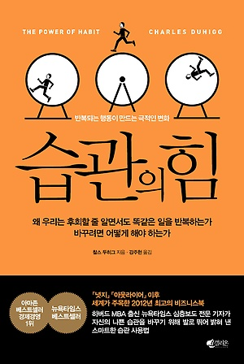
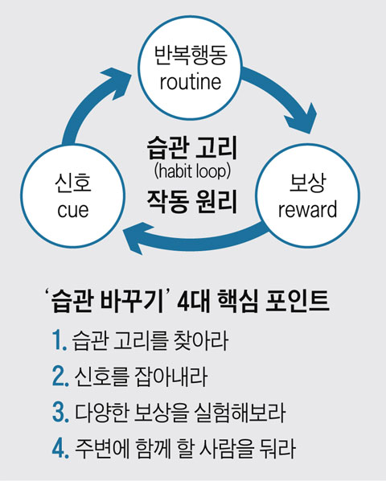

# 습관의 힘 독후감

나의 평점(10점 만점) : 8.5

이 책이 뭐 우리가 좋은 습관을 가지고 나쁜 습관을 버릴 수 있는 그런 방법론을 제시하는 것은 아니다. 하지만 우리가 무의식적으로 하고 있는 이 습관이라는 것이 얼마나 중요한것이며 우리의 인간사회를 이루어가고 있는지를 여러 이야기로 잘 풀어나가는 책이다.

## 습관의 생겨나는 연결고리

습관이 생기는건 생각보다 별것 아니다. 내가 행동했을때 그것에 대해 적절한 보상이라고 느껴지는것이 들어올때 머릿속에 무의식적으로 생기는 것이다. 결국 우리는 이 연결고리 속에서 반복된 행동을 없애기 위해서 무얼해야 할까? 신호가 되는것들을 차단, 반복행동에 대한 저항, 보상을 다르게하거나 없앤다. 나는 마지막 방법이 제일 효과적이라 본다. 행동에대한 보상이 없어지면 습관은 자연스레 없어질것이라 생각하기 때문이다. 어쩌면 이러한 고리 때문에 우리에게 나쁜 습관이 생기기 더 쉬운게 아닐까 싶기도 하다.

## 기억은 사라져도 습관은 남는다.
유진에 대한 이야기다. 기억상실증에 걸려 기본적인 것도 기억을 못하고 짧은 시간 전에 일어난 일도 기억을 못하지만 무의식적으로 집을 찾아오고, 특정한 일을 한다. 기억이 없는데 어떻게? 유진도 자신이 어떻게 그 일을 한지 모른다. 이것은 기억이 없음에도 습관이 뇌에 남음을 알 수 있는 실험이라 한다.

## 습관을 이용한 비즈니스
우리가 무의식적으로 하는 소비 패턴, 양치질, 페브리즈 등 우리는 습관의 포로이다. 소비자가 보상이라 생각할 수 있는것 (대표적으로 열망을 이책에서는 말한다.)을 던져주고 반복적으로 자신의 제품을 소비하도록하라. 그것이 바로 습관을 이용한 비즈니스다.

## 습관은 왜 있는가?
인간에게 습관이 있는 것은 뇌의 에너지 소모를 줄이기 위해서이다. 한마디로 뇌는 cpu, 습관은 cache이다. 자주 사용하는 것들을 cache에 담아놓고 뇌 에너지를 비교적 적게사용하여 복잡한 일을 처리 할 수 있게 하는 것이다. 이것은 잘만 활용하면 삶이 풍요로워 질 수 있다는 뜻이다.

## 습관을 고치는 방법
* 반복 행동을 찾아라
* 다양한 보상으로 실험해 보라
* 신호를 찾아라
* 계획을 세워라

신호를 찾기 위한 질문

* 어디에 있는가?
* 몇시 인가?
* 감정 상태는 어떤가?
* 주변에 누가 있는가?
* 충동이 있기 직전에 무엇을 했는가?

습관을 인식했을 때 이러한 5가지 질문이 신호를 찾는 도움이 될것이다.