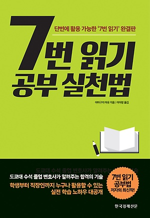
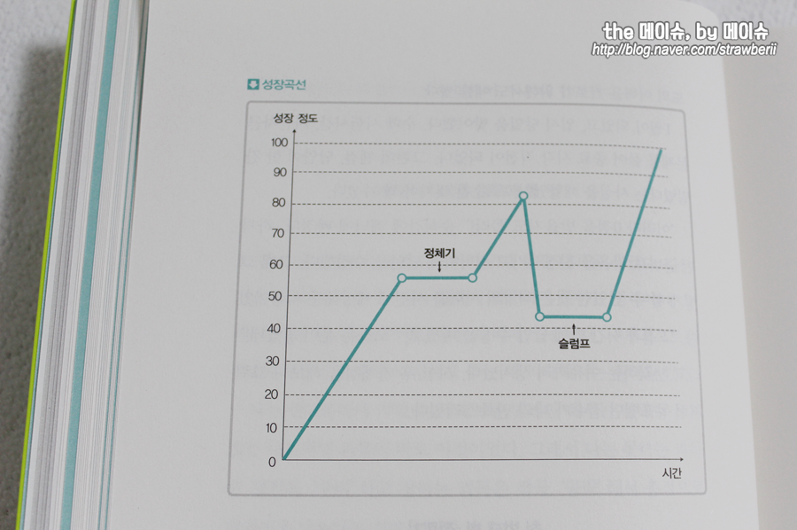
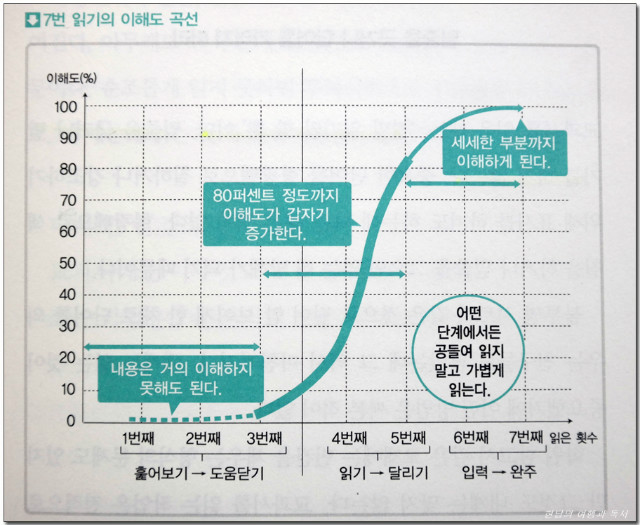

# 7번 읽기 공부 실천버 독후감

나의 평점(10점 만점) : 8.6

이 책이 없었다면 솔직히 이 시리즈에 대한 평점은 바닥이었을 것이며 이 공부법이 뜨지도 않았을 것이랄 생각한다. 확실히 여러번 보며 익숙해지면 더 이해도 잘되고 공부하기 좋다. 이건 나도 옛날부터 느낀것이다. 근데 이 사람은 그거에 대한 방법론을 자신의 공부법으로 승화시킨것이다. 이 책도 책내용을 채우기 심심했는지 자기 과거에서 얻은 교훈이 대부분을 차지한다. 그럼 어떤가? 실천법에 대해 자세히 적혀 있다.

## 정체기와 슬럼프에 관해

이건 머.. 그래프가 다 설명해준다. 정체기가 오든 슬럼프가 오든 이겨내면 나는 성장한다!! 그걸 믿고 꾸준히 하자. 너무 힘들면 쉬면되고 ㅎㅎ

## 공부하는 자세
다리 한쪽을 의자위에 올리고 허벅지를 가슴에 붙인다 이렇게하면 자세가 흐트러지지않고 책을 적절한 높이에서 읽을 수 있다. 나도 해봤는데 나쁘지 않았다. 그런데 이거 허리나 골반 건강에 괜찮을지는 의문이다.

## 7번 읽기 공부법

1번째 읽기

우선 전체를 훑어 본다.(읽지 말고 본문 전체를 훑어본다.) 
1~3번째에 의식할 점은 훑어보기만 해도 괜찮으니 전체를 파악하는 것이다. 목차를 만들듯, 큰제목, 소제목을 빈 백지에 옮기듯이 읽는다. 지그재그로 서치라이트 방식으로 읽는다. 그림이나 표는 건너뛴다. "책장을 일정한 속도로 넘기는데 집중한다(8초)". 핵심은 "속도"이다.

2번째 읽기

확인하면서 단어를 골라낸다.(글자뿐만 아니라 숫자도 잡아낸다.)

첫번째와 같은 속도로 읽어나간다. 사진, 그림, 글자도 눈에 익힌다.(읽는건 아니다.)

3번째 읽기

눈에 띄는것을 가볍게 습득한다.(서치라이트에서 레이저 빔으로)

3번째에서는 1,2번째의 두배인 16초정도 소요한다.(약 1시간) 왼쪽에서 오른쪽으로 읽어준다. 가볍게 훑어본 페이지를 어렴풋이 떠올리며 조금 더 주의 기게 전체를 파악하는 느낌으로 읽는다. "좋다" "싫다"를 의시한다. 그 부근에 이런게 있었는 듯한 기분이 든다 정도로 어렴풋이 기억이 나는 수준이면 된다.

4번째 읽기

의미를 파악하며 읽는다.(4번째부터는 읽는다!!)

3번째까지가 익숙해지기 였다면 이제는 묵독을 해준다. 2시간 정도 소요하며(한페이지당 40초) 왼쪽에서 오른쪽으로 읽어준다. 평범하게 읽어주면 된다.

5번째 읽기

예상하면서 읽는다.

4번째와 같이 묵독을 해주며, 두번째 묵독이므로 4번째보단 짧은시간에 읽을 수 있다. 다음엔 이런내용이 있을거야란 생각을 해보며 예상을 하며 읽어본다. 여기까지 공부하면 머릿속에 지식이 어중간하고 애매한 상태라고 본다.

6번째 읽기

요령을 정리하여 머릿속에 입력한다.(일반적 읽기x골라 읽기와 요약)

6번째 읽기에서는 2시간 22분 정도 걸린다. 이만큼 걸린다는 것은 꼼꼼히 읽는다는 것, 페이지를 넘기기 전에 다시 한번 한장을 읽어보며 머릿속에서 요약한다. 되풀이 골라읽기는 서치라이트 식으로 한다. 요점은 완전히 문장화하는게 아닌 기본적인 단어 중심으로 연결해내가는 것이다.

7번째 읽기

세세한 부분이 재현될 때까지 완벽을 기한다.(6번째 읽기의 요약을 재현하면서 읽는다.)

이 방법도 2시간 18분 정도 걸린다. 7번째 읽기에서는 페이지를 펼치자마자 왼쪽 페이지를 요약한다. 6번째에 요약했던 내용을 떠올리며 두세 줄씩 서치라이트 방식으로 읽는 동시에 요약하는 것이다. 그렇게 요약한 후에 한줄씩 다시 한번 읽는다. 6번째 방식의 거꾸로인 셈이다.

1~3번째를 훑어보기(도움닫기)

4~5번째를 묵독(달리기)

6~7번째를 입력(완주)

라고 저자는 비유하고 있다.

이 방법의 치명적인 단점은 입력이 무수히 많고 아웃풋이 너무 없다는 것이다. 저자 역시 자신이 아웃풋 관련하여 트라우마가 있어 오직 시험만을 위한 이러한 공부법을 만들었다고 했으니... 개인적으로 첫번째 두번째 읽기 정도는 합쳐도 될것 같고, 아웃풋으로 백지에다 모든 읽기를 마친 후 적어보고 많이 못적은 부분에 대해 다시 읽고 요약 정리해보는 식으로 해보는게 좋다고 생각한다. 습관만 들이면 충분히 좋은 메타인지 공부법인것 같다. 문과식 이과식 등으로 나눠서 설명해주는데, 뭐.. 그건 알아서 응용하는걸로 한다.