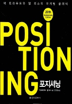
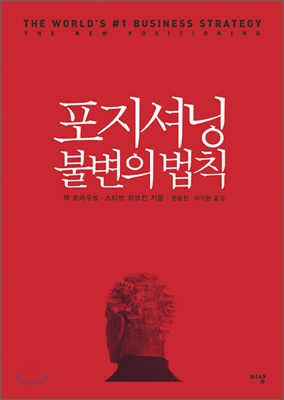

# 포지셔닝 (불변의법칙) 독후감

평점 : 8.2

2002년판 2016년판 다 있길래 두권다 빌려서 봤다. 내용은 이전걸 개정한 수준이였다. 기업 또는 브랜드, 제품의 포지션은 사실 우리의 가상세계 속의 약속에서 정의된다. 이게 무슨말이냐? 우리가 지금 살고 있는 집을 생각해보자. 우리는 이 집이 내집이라는 계약서를 갖게되고, 그 계약서를 보증해주는 객체가 있음에 그 객체를 믿는 사람들끼리 이 집이 내집이라는 것을 증명하게 되는것이다. 이것은 가상의 약속이다. 회사 또한 가상세계에서의 약속으로 이루어진 집단이다. ~~회사이며, ~~하는 일을하며, ~~하는 제품과 서비스를 제공한다는 정의를 내걸고 하나의 큰 의지를 이루어 이러한 약속에 의해 기업은 성장해나간다. 포지셔닝은 결국 이러한 가상의 세계에서 우리의 회사, 제품, 서비스 등이 어떠한 위치에 있게 할 수 있는가에 대한 물음이다. 많은 예시들을 통해 책이 이루어져 있는데, 이것은 포지셔닝에는 마땅한 정답이 없기때문이기도 한것 같다. 결국에는 많은 경우의수가 복합되는게 마케팅이며 그 효과를 측정하는 방법 또한 모호하기 때문이다.

아직 마케팅에 대한 지식이 전무해서 그런지 많은 공감을 하면서 읽지는 못했다. 아~ 그냥 이런 사건이 있었구나... 라는 정도? 우리가 알아야 할 것은 소비자는 어떠한 제품과 관련하여 기껏해야 5개이상은 잘 기억하지 못한다는것(예를 들어 신발, 옷, 햄버거, 피자 등 브랜드를 생각해보자. 자신이 엄청 관심을 가진 분야가 아니라면 5개이상 기억하기는 힘들 것이다.) 이러한 상황에서 우리는 5개 안에 드는게 아닌 새로운 영역의 확장이 필요하다. 소비자는 단순하고, 변덕스러우며, 마음은 좀처럼 움직여주지 않은 까다로운 여자친구다. 참으로 피곤하지 않을수가 없다 =-=

우리가 리포지션 하는 방법은 여러가지가 있다. 대표적으로 몇가지만 보자면, 제품을 줄이고 특정 제품만 집중하여 질을 높이는것, 적절한 이름으로 바꾸는것, 경쟁이 아닌 새로운것으로 갈아타는것, 차별점을 만드는것, 복수 브랜드를 운영하는 것 정도가 있다. 하지만 리포지셔닝은 항상 주의해가며 해야한다. 그 동안에 쌓아왔던것들 또한 한 순간에 무너질 수 있기 때문이다.