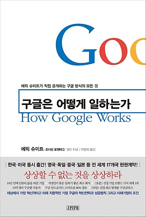

# 구글은 어떻게 일하는가 독후감

나의 평점(10점 만점) : 3.4

"구글은 어떻게 일하는가" 정말 손이 갈래야 안갈수 없는 책 제목이다. 하지만 내용은... 그렇게 직접적으로 도움이 되는것은 없는것 같다. 내가 아직 부족해서 모르는거일수도 있겠지만 말이다. 특히 이 책은 번역본인데, 번역을 너무 개떡같이 해놓았다. 읽다가 힘들어서 인터넷에 리뷰를 쳐봤는데 나처럼 생각하는 사람이 꽤 많았다... 내가 이책을 읽게 된 계기는 `howgoogleworks.pdf`를 보면서이다. 이 책 한번 읽느니 이 pdf한번을 읽는게 결국 내용이 다 담겨져 있다는걸 책을 다 읽고나서야 알았다.

핵심 내용만 말하자면 이것이다. 자신이 이 프로젝트를 함으로써 무엇이 달라졌는가?를 항상 생각해야 한다. 똑똑하고 창의력이 뛰어난 사람을 뽑아라(이 방법에 대한 내용이 거의 절반이다) 회사 안에 수많은 조직을 스타트업처럼 키워라. 수평적 환경을 만들어라. 인재가 원하는 환경을 만들어라. 책임을 지는 사람을 만들어라. 등등의 내용이다. 하지만 이러한 내용들은 어느정도 중견기업이 되고나서야 고려해보고 고민해볼 문제들이다. 스타트업한테 그런 금전적 여유가 없기 때문이다.

이 책을 읽어보며 느꼈던것은 딱히 특별함과 새로운게 없었다는 것이다. 이미 잘 알려진 구글의 슬로건이며, 구글은 하나의 커다란 산이며 그 산에 잘 길러진 나무들을 옮겨 심는 행위를 반복하며 몸집을 키워나간다. 주 수익모델 또한 지금까지 없었던 것을 위주로 하는데(애드센스, Firebase, Gmail 등), 남들이 따라하기 힘들정도의 독보적인 기술력을 가졌다는 것 또한 대단하다고 생각한다. 만약 구글에서 네이버 스토어 팜처럼 검색엔진에서 제공하는 쇼핑몰을 도입한다면 그 파급력이 얼마나 클지 상상도 안간다. 구글은 솔직히 말하자면 돈을 벌 수 있는 방법이 수도 없이 많다. 이미 신뢰하는 사용자를 어마어마하게 확보했기 때문이다. 그런 기업에 대한 책을 당연히 IT쪽 사람들은 관심을 보이며 보게될것이다. 하지만 이 책은 구글의 이름을 빌린 똥책이다...