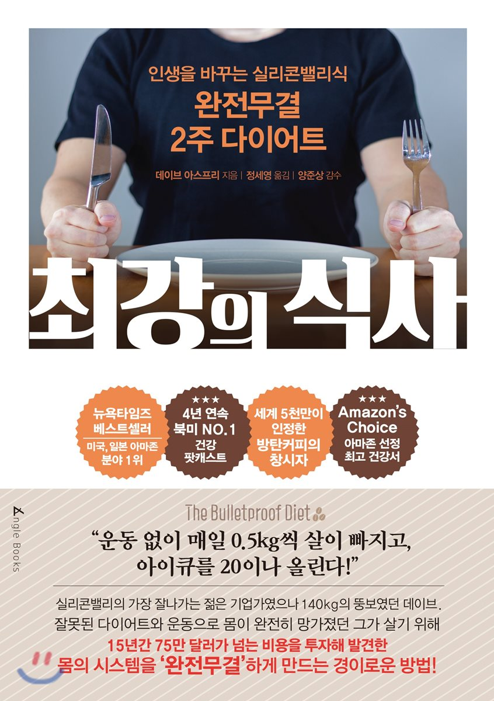

# 최강의 식사 독후감

나의 평점(10점 만점) : 5.2

태화 가족도서관에서 책 정리하다 우연찮게 보게된 책이다. 전 IT기업가가 건강문제를 가지게 되면서 엄청난 돈을 들여 실험한 내용들을 담은 내용이다. 이 책에서는 내 몸을 해킹한다는 내용이 참 많이 나온다. 맞다. 나도 항상 내몸과 정신을 제어하기 위해 해킹하려 노력한다. 물론 내몸의 느낌으로 판단하기 때문에 이건 휴리스틱이다. 이러한 휴리스틱적 판단이 맞았는지 확인해볼 수 있는 책이였다. 문제는 이 책에 나온대로 실천하기 위해서는 현실적으로 많이 힘들다는 것이다. 일단 돈이 너무 많이 들어간다.(책 마지막부분에 레시피부분을 보면 가관이다...) 인간은 진화해오며 더 싸게 더 많이 더 빠르게 동물을 기르는 방법을 토대로 해왔다. 그리고 우린 그러한 고기를 먹는다. 그러한 식물을 먹는다. 하지만 그는 그것은 건강에 검증되지 않은 것이며 몸에 안좋다고 한다. 그리고는 옛방식으로 기른 동물과 식물을 먹으라고 한다. 한마디로 돈이 엄청 든다는 것이다...ㅋㅋ 이 책은 다이어트 목적보다는 향후 건강을 위해 우리가 어떠한 식단을 가져야 하는지에 대한 내용을 담고 있어서 좋았다. 그나마 현실성있고 할만한게 있었으며, 저자가 매우 추천하는 것이 있었는데, 바로 방탄 커피이다. 방탄 커피는 양질의 커피콩으로 진하게 내린 커피, 목초를 먹인 소의 우유로 만든 무염 버터(긴버터) 1큰술, MCT오일 또는 코코넛 오일 1큰술 이다. 이 책을 보고 나와 같은 생각을 한사람이 많은지 방탄커피에 대한 포스팅과 글이 꽤 많고 효과를 본사람들도 꽤 있다는 것을 알게 되었다. 알고보니 이 저자.. mct오일, 커피, 버터를 파는 기업을 운영하고 있다. 역시 기업인의 피는 못속이나 보다.. 마케팅 오지게 잘한듯

지금 당장 시행해보고 있진 않지만 만약 한다면 적당한 가격에 시행할 수 있는걸 찾아 보았다.

커피 : 잘 모름 =-=

mct 오일 : 
https://www.coupang.com/vp/products/8934123?itemId=39178233&vendorItemId=4041700404&q=mct+%EC%98%A4%EC%9D%BC&itemsCount=36&searchId=ad38f25bfbfb4f8a836be2e04404bc5c&rank=0

앵커 버터 : https://search.shopping.naver.com/detail/detail.nhn?cat_id=50001759&nv_mid=5698230373&query=%EC%95%B5%EC%BB%A4%EB%B2%84%ED%84%B0&frm=NVSCPRO&NaPm=ct%3Djrmwabjk%7Cci%3Dfd94b3ab4db4d4bfe1b4940ff37b76b00a558300%7Ctr%3Dsls%7Csn%3D95694%7Chk%3Dc9977985b2320d9314e3e8489116b8f026f341ec

저자가 만드는 방탄 커피
https://www.youtube.com/watch?time_continue=324&v=4YjLMdx3YZY